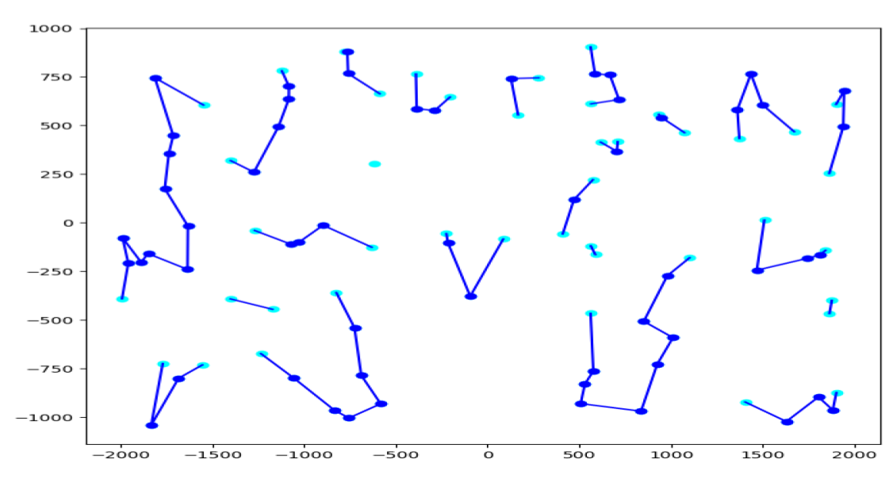

The ML-Constructive Heuristic
=========
The general idea
----------
ML-Constructive is the first constructive heuristics 
that scales efficiently using information extracted from historical TSP optimal solutions.
It exploits machine learning (ML) to learn patterns from previous optimal solutions, 
then it uses the pattern recognition skills to construct the TSP solution in two phases.

The first phase uses ML to filter some promising edges from the shortest edges connecting each vertex.
As shown in Figure 1.


<p align="center">
	
</p>


For more details see [1]. 

The second phase uses the Clarke-Wright heuristic to complete the TSP tour as in Figure 2. 

<p align="center">
	
</p>


For the curious readers, we suggest to look through the survey on ML approaches for the TSP [2], 
and an unusual example on how to combine combinatorial optimization concepts 
with the reward function of reinforcement learning setups for the TSP [3]. 


Papers
-----
<a id="1">[1]</a>
Mele, U. J., Gambardella, L. M., and Montemanni, R. (2021).
A New Constructive Heuristic driven by Machine Learning for the traveling Salesman Problem.


<a id="1">[2]</a> 
Mele, U. J., Gambardella, L. M., and Montemanni, R. (2021). 
Machine learning approaches for the traveling salesman problem: A survey.
In Proceedings of the 8th International Conference on Industrial Engineering and Applications (ICIEA 2021).
Association for Computing Machinery.

<a id="1">[3]</a>
Mele, U. J., Chou, X., Gambardella, L. M., and Montemanni, R. (2021).
Reinforcement Learning and additional rewards for the traveling salesman problem.
In Proceedings of the 8th International Conference on Industrial Engineering and Applications (ICIEA 2021).
Association for Computing Machinery.


How to install?
------

```shell
git clone https://github.com/########
cd ML-greedy/version1/
```

Requirements
------


Dataset creation
------
The data creation it takes 12 hours for the 
```shell
python cli.py --operation create_instances
```

Statistical test
----

```shell
python cli.py --operation show_stats
```

Train
-----
```shell
python cli.py --operation train
```

Test
----
```shell
python cli.py --operation test_on_TSPLIB
```


